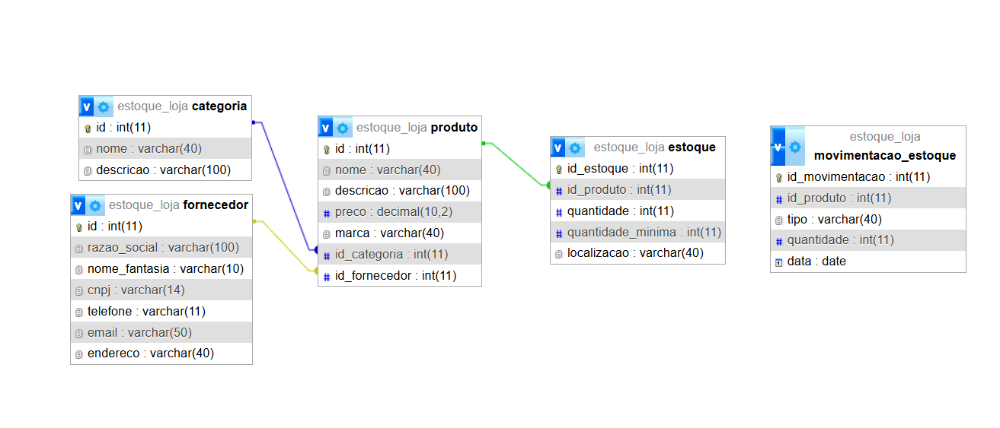
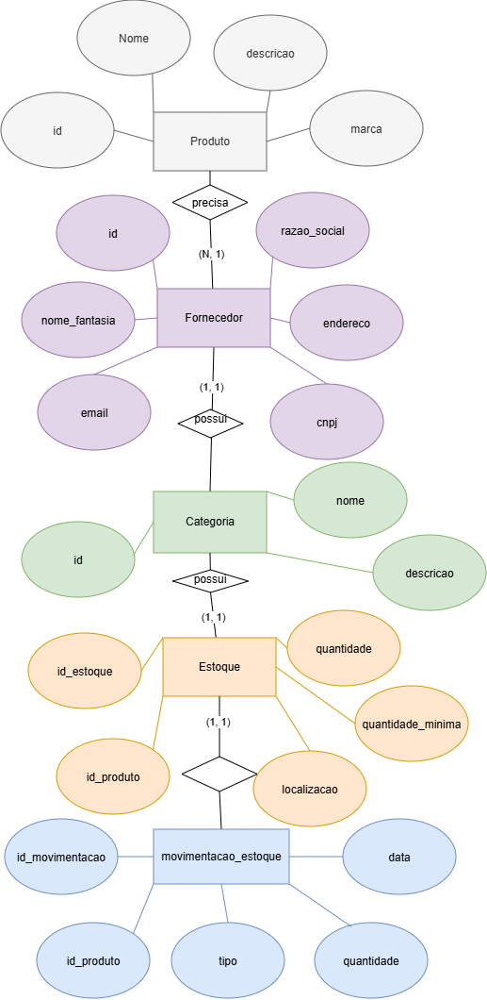

# VPF01 - BCD
## Projeto: Gestâo de Pedidos
``LOGICO``

``CONCEITUAL`` <br>

## Dicionário de Dados

|Entidade|Atributo|Tipo|Tamanho|Descrição|
|-|-|-|-|-| 
|Categoria|id|int|11|Identificador, PK, Auto incrementável|
|Categoria|nome|varchar|40|Nome da categoria|
|Categoria|descricao|varchar|100|Descrição da categoria|
|Fornecedor|id|int|11|Identificador, PK, Auto incrementável|
|Fornecedor|razao_social|varchar|100|Nome da empresa do fornecedor|
|Fornecedor|nome_fantasia|varchar|10|Sigla da empresa do fornecedor|
|Fornecedor|cnpj|varchar|14|CNPJ do fornecedor|
|Fornecedor|telefone|varchar|11|Telefone do fornecedor|
|Fornecedor|email|varchar|50|E-mail do fornecedor|
|Fornecedor|endereco|varchar|40|Endereço do fornecedor|
|Produto|id|int|11|Identificador, PK, Auto incrementável|
|Produto|nome|varchar|40|Nome do produto|
|Produto|descricao|varchar|100|Descrição do produto|
|Produto|preco|decimal|10,2|Preço do produto|
|Produto|id_categoria|int|11|Identificador, FK|
|Produto|id_fornecedor|int|11|identificador,FK|
|Estoque|id_estoque|int|11|Identificador, PK, Auto incrementável|
|Estoque|id_produto|int|11|Identificador,FK|
|Estoque|quantidade|int|11|Quantidade do produto em estoque|
|Estoque|quantidade_minima|int|11|Quantidade mínima|
|Estoque|localizacao|varchar|40|Localização do estoque|
|Movimentacao_estoque|id_movimentacao|int|11|Identificador, PK, Auto incrementável|
|Movimentacao_estoque|id_produto|int|11|Identificação, FK|
|Movimentacao_estoque|tipo|varchar|40|Entrada ou saída do produto do estoque|
|Movimentacao_estoque|quantidade|int|11|Quantidade do produto que está saindo ou entrando no estoque|

## Dados de teste em CSV
* [categoria.csv](categoria.csv)
* [fornecedor.csv](fornecedor.csv)
* [produto.csv](produto.csv)
* [estoque.csv](estoque.csv)
* [movimentacao_estoque.csv](movimentacao_estoque.csv)

## Script SQL DDL (Desenvolvimanto: Criação do Banco de dados)

```sql
drop database if exists estoque_loja;
create database estoque_loja;
use estoque_loja;
create table produto(
    id int not null primary key auto_increment,
    nome varchar(40) not null,
    descricao varchar(100),
    preco decimal(10,2) not null,
    marca varchar(40) not null,
    id_categoria int not null,
    id_fornecedor int not null
);
create table categoria(
    id int not null primary key auto_increment,
    nome varchar(40) not null,
    descricao varchar(100)
);
create table fornecedor(
    id int not null primary key auto_increment,
    razao_social varchar(100) not null,
    nome_fantasia varchar(10) not null,
    cnpj varchar(14) not null,
    telefone varchar(11) not null,
    email varchar(50) not null,
    endereco varchar(40) not null
);
create table estoque(
    id_estoque int not null primary key auto_increment,
    id_produto int not null,
    quantidade int not null,
    quantidade_minima int not null,
    localizacao varchar(40) not null
);
create table movimentacao_estoque(
    id_movimentacao int not null primary key auto_increment,
    id_produto int not null,
    tipo varchar(40) not null,
    quantidade int not null,
    data date
);

alter table produto add constraint fk_categoria foreign key (id_categoria) references categoria(id);
alter table produto add constraint fk_fornecedor foreign key (id_fornecedor) references fornecedor(id);
alter table estoque add constraint fk_produto foreign key (id_produto) references produto(id);

describe produto;
describe categoria;
describe fornecedor;
describe estoque;
describe movimentacao_estoque;
show tables;
```

## Script SQL DML(Manipulação: População com dados de teste)

```sql
use estoque_loja;

insert into categoria(nome, descricao) values
("Camiseta", "Camiseta Unisex"),
("Calça Jeans", "Calça Unisex"),
("Camisa", "Camisa Unisex");

select * from categoria;

insert into fornecedor(razao_social, nome_fantasia, telefone, email, cnpj, endereco) values
("Roupas Diversas","RD","19993258698","roupasdiversas@gmail.com","08659458/0001-99","Rua Encomendador"),
("Jeans++","J++","19991539875","jeansplusplus@gmail.com","09524757/0008-56","Rua Camandocaia"),
("Space Me!","SM","19962457893","spacememe@gmail.com","01255682/0007-88","Rua Ítalia");

select* from fornecedor;

insert into produto(nome, descricao, preco, marca, id_categoria, id_fornecedor) values
("Camiseta Linkin Park","Camiseta da banda norte americana Linkin Park","30","sem marca",1,1),
("Calça Jeans","Calça Jeans tamanho M","60","Jeans",2,2),
("Camiseta Meteora","Camiseta do albúm Meteora (2003) da banda norte americana Linkin Park","37","sem marca",3,1);

select * from produto;

insert into estoque(id_produto, quantidade, quantidade_minima, localizacao) values
("1","3", "1","Rua Azevedo"),
("2","4", "1","Rua Encomendador"),
("3","1", "1","Rua Figueira");

select * from estoque;

insert into movimentacao_estoque(id_produto, tipo, quantidade, data) values
("1","Saída","3","2026-02-27"),
("2","Entrada","4","2026-05-10"),
("3","Saída","1","2026-02-07");

select * from movimentacao_estoque;
```
